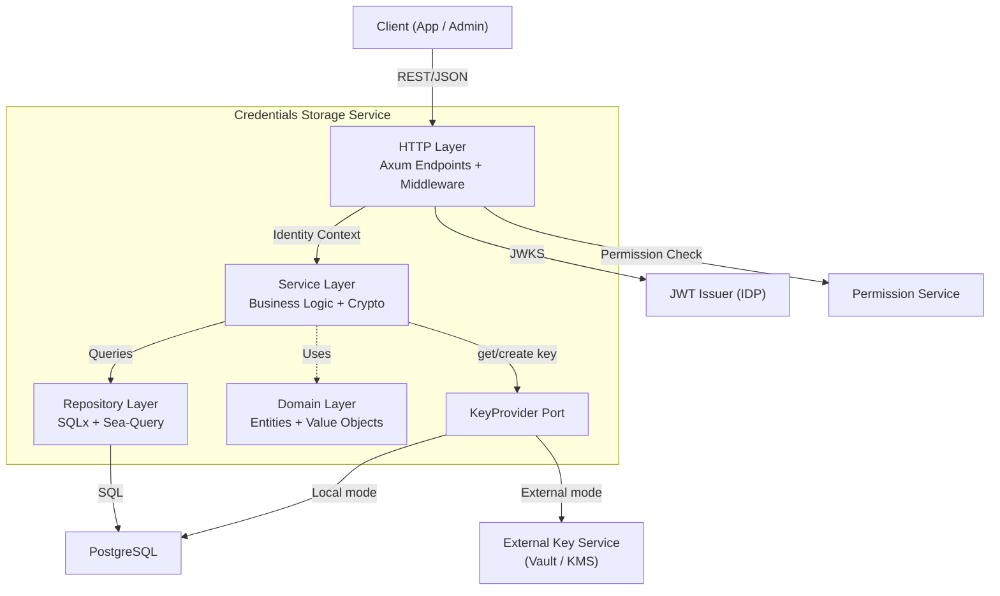
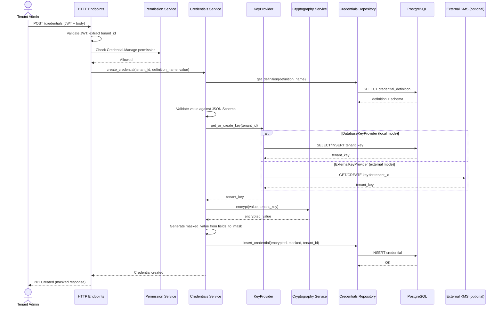
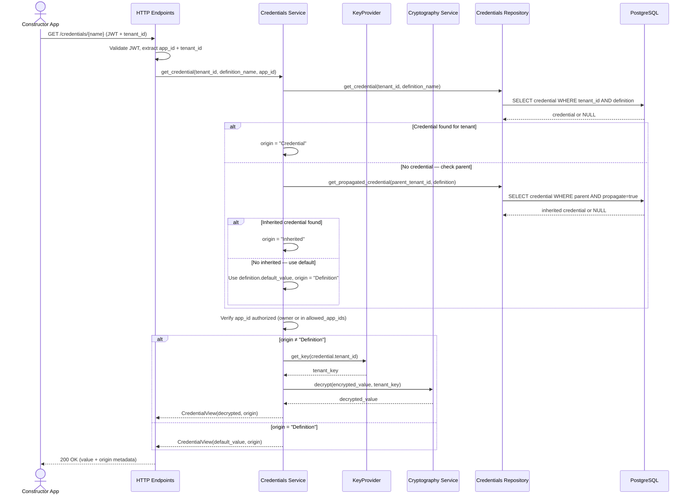
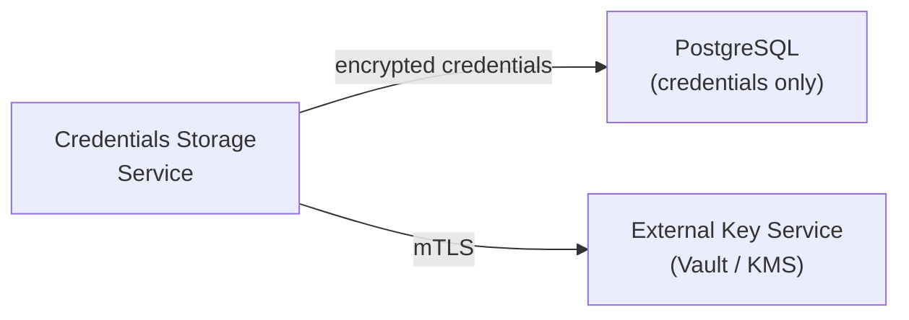

# Technical Design — Credentials Storage Plugin

- [ ] `p3` - **ID**: `cpt-pc-cs-design-credentials-storage`

<!-- toc -->

- [1. Architecture Overview](#1-architecture-overview)
  - [1.1 Architectural Vision](#11-architectural-vision)
  - [1.2 Architecture Drivers](#12-architecture-drivers)
  - [1.3 Architecture Layers](#13-architecture-layers)
- [2. Principles & Constraints](#2-principles--constraints)
  - [2.1 Design Principles](#21-design-principles)
  - [2.2 Constraints](#22-constraints)
- [3. Technical Architecture](#3-technical-architecture)
  - [3.1 Domain Model](#31-domain-model)
  - [3.2 Component Model](#32-component-model)
  - [3.3 API Contracts](#33-api-contracts)
  - [3.4 Internal Dependencies](#34-internal-dependencies)
  - [3.5 External Dependencies](#35-external-dependencies)
  - [3.6 Interactions & Sequences](#36-interactions--sequences)
  - [3.7 Database schemas & tables](#37-database-schemas--tables)
  - [3.8 Deployment Topology](#38-deployment-topology)
- [4. Additional context](#4-additional-context)

<!-- /toc -->

## 1. Architecture Overview

### 1.1 Architectural Vision

Credentials Storage is designed as a self-contained module (deployable as part of the CredStore gateway or as a
standalone microservice) with a layered hexagonal architecture that isolates domain logic from infrastructure concerns.
The architecture prioritizes security-by-default: every credential value is encrypted before reaching the persistence
layer, and access control is enforced at multiple levels — JWT authentication, permission-based authorization, and
application-level access restrictions.

Tenant encryption key management is abstracted behind a `KeyProvider` port, allowing keys to be stored either locally
(in-database, for development and simple deployments) or in a separate, hardened key management service (for production
environments where cryptographic isolation is required). This separation ensures that compromising the credentials
database does not expose encryption keys, and vice versa.

### 1.2 Architecture Drivers

Requirements that significantly influence architecture decisions.

#### Functional Drivers

| Requirement                                                         | Design Response                                                                                      |
|---------------------------------------------------------------------|------------------------------------------------------------------------------------------------------|
| `cpt-pc-cs-fr-credential-encrypt` — Encrypt all values at rest      | Dedicated cryptography service with AES-256-GCM; per-tenant key management via pluggable KeyProvider  |
| `cpt-pc-cs-fr-credential-propagate` — Hierarchical propagation      | Credential merge logic in service layer resolves tenant → parent → default chain                     |
| `cpt-pc-cs-fr-credential-mask` — Field-level masking                | Schema-driven masking applied at service layer before response construction                          |
| `cpt-pc-cs-fr-credential-decrypt-app` — Decrypted values for apps   | Separate app/user response paths in endpoint layer with identity-based routing                       |
| `cpt-pc-cs-fr-definition-allowed-apps` — Application access control | Service-level authorization check against definition's allowed_app_ids list                          |
| `cpt-pc-cs-fr-auth-jwt` — JWT authentication                        | Axum middleware extracts and validates JWT; identity propagated through request context              |
| `cpt-pc-cs-fr-auth-permission` — Permission checks                  | Permission middleware calls external Permission Service before write operations                      |

#### NFR Allocation

| NFR ID                           | NFR Summary                        | Allocated To                                 | Design Response                                                                                        | Verification Approach                                                                    |
|----------------------------------|------------------------------------|----------------------------------------------|--------------------------------------------------------------------------------------------------------|------------------------------------------------------------------------------------------|
| `cpt-pc-cs-nfr-encryption`       | 100% encryption at rest            | Cryptography Service + KeyProvider           | All credential values pass through encrypt() before persistence; no direct DB writes bypass encryption | Integration tests verify no plaintext in DB                                              |
| `cpt-pc-cs-nfr-tenant-isolation` | Per-tenant cryptographic isolation | KeyProvider + Cryptography Service           | Each tenant has a unique AES-256 key; keys never shared across tenants; keys can be isolated in external KMS | Unit tests verify key uniqueness; integration tests verify cross-tenant decryption fails |
| `cpt-pc-cs-nfr-response-time`    | p95 ≤ 100ms at 100 concurrent      | All layers                                   | Async I/O via Tokio; connection pooling; in-memory JWKS cache                                          | Load testing with k6 or similar                                                          |

### 1.3 Architecture Layers

- [ ] `p3` - **ID**: `cpt-pc-cs-tech-layers`

| Layer          | Responsibility                                                                      | Technology                     |
|----------------|-------------------------------------------------------------------------------------|--------------------------------|
| HTTP           | Request routing, JWT validation, permission middleware, error mapping, OpenAPI docs | Axum 0.8, Tower-HTTP, Utoipa   |
| Service        | Business logic, credential merge, encryption/decryption, masking, schema validation | Core Rust, AES-GCM, Serde JSON |
| Repository     | Data access, query construction, connection management                              | SQLx 0.8, Sea-Query 0.32       |
| KeyProvider    | Tenant key retrieval and creation; abstracts local DB vs external key service       | Trait-based port (see §3.2)    |
| Domain         | Core entities (Schema, CredentialDefinition, Credential), value objects, enums      | Pure Rust structs              |
| Infrastructure | Configuration, telemetry, server lifecycle, connection pooling                      | Tokio, OpenTelemetry, Clap     |

## 2. Principles & Constraints

### 2.1 Design Principles

#### Encryption by Default

- [ ] `p2` - **ID**: `cpt-pc-cs-principle-encryption-default`

All credential values are encrypted before leaving the service layer. The repository layer never receives plaintext
credential data. This ensures that even in the event of a database compromise or SQL injection, credential values remain
protected.

#### Tenant Isolation

- [ ] `p2` - **ID**: `cpt-pc-cs-principle-tenant-isolation`

Each tenant's credentials are encrypted with a unique per-tenant key. No shared encryption keys exist between tenants.
This provides cryptographic isolation — compromising one tenant's key does not expose another tenant's data.

#### Key–Data Separation

- [ ] `p1` - **ID**: `cpt-pc-cs-principle-key-data-separation`

Encryption keys and encrypted data MUST be separable into distinct security domains. The service abstracts key
management behind a `KeyProvider` port so that tenant keys can reside in a separate, hardened service (e.g., HashiCorp
Vault, AWS KMS, or a dedicated internal key management service) rather than in the same database as encrypted
credentials. This ensures that a single breach (database compromise, SQL injection, backup leak) does not expose both
ciphertext and the keys needed to decrypt it.

#### Least Privilege Access

- [ ] `p2` - **ID**: `cpt-pc-cs-principle-least-privilege`

Access control is enforced at multiple levels: JWT authentication verifies identity, permission middleware validates
authorization, and application-level checks verify the caller is authorized for the specific credential definition.
Users see only masked values; only authorized applications receive decrypted values.

#### Defense in Depth

- [ ] `p2` - **ID**: `cpt-pc-cs-principle-defense-in-depth`

Security is layered: network-level (Kubernetes service mesh), transport-level (TLS), authentication (JWT),
authorization (Permission Service), application-level (allowed_app_ids), and data-level (AES-256-GCM encryption). No
single layer's failure exposes credentials.

#### Clean Architecture

- [ ] `p3` - **ID**: `cpt-pc-cs-principle-clean-architecture`

Domain entities have zero dependencies on infrastructure. The service layer orchestrates business logic without
knowledge of HTTP or SQL specifics. This separation enables unit testing of business logic without database or network
setup.

### 2.2 Constraints

#### Constructor Platform Integration

- [ ] `p2` - **ID**: `cpt-pc-cs-constraint-platform-integration`

The service must integrate with the CyberFabric platform ecosystem: JWT tokens from the Vendor IDP, permission
checks via the Permission Service, and tenant hierarchy from the platform API. All inter-service communication uses
internal Kubernetes DNS.

#### PostgreSQL Persistence

- [ ] `p2` - **ID**: `cpt-pc-cs-constraint-postgresql`

PostgreSQL is the platform-standard database. All persistent data (schemas, definitions, credentials, tenant keys) must
be stored in PostgreSQL. No alternative databases are permitted without a new ADR.

#### Kubernetes Deployment

- [ ] `p2` - **ID**: `cpt-pc-cs-constraint-kubernetes`

The service must be deployable on Kubernetes via Helm chart, supporting horizontal pod autoscaling, pod disruption
budgets, readiness/liveness probes, and graceful shutdown.

#### JWT-Based Authentication

- [ ] `p2` - **ID**: `cpt-pc-cs-constraint-jwt-auth`

All API endpoints require JWT Bearer token authentication. Tokens must be validated against JWKS endpoints provided by
the Vendor IDP. Identity claims (tenant_id, application_id) must be extracted and propagated to the service layer.

#### Multi-Tenant Hierarchy Support

- [ ] `p2` - **ID**: `cpt-pc-cs-constraint-multi-tenant`

The service must support the Constructor platform's hierarchical tenant model for credential propagation. Credential
resolution must traverse the tenant tree from child to parent.

## 3. Technical Architecture

### 3.1 Domain Model

**Technology**: Rust structs with Serde serialization

**Core Entities**:

| Entity               | Description                                                                                                  |
|----------------------|--------------------------------------------------------------------------------------------------------------|
| Schema               | Defines the JSON structure of credential values and which fields to mask. Bound to an application.           |
| CredentialDefinition | Template binding a schema to an application with default values and access control list.                     |
| Credential           | An encrypted tenant-specific credential value for a given definition, with masking and propagation metadata. |
| TenantKey            | A per-tenant AES-256-GCM encryption key used for credential encryption and decryption. Managed by the `KeyProvider` port — may reside in local DB or an external key management service. |

**Relationships**:

- Schema 1→N CredentialDefinition: each definition references one schema for validation
- CredentialDefinition 1→N Credential: each credential belongs to one definition
- TenantKey 1→N Credential: each tenant key encrypts all credentials for that tenant (key resolution via `KeyProvider`)
- Schema → fields_to_mask: schema defines which fields are masked in credential responses

### 3.2 Component Model

#### HTTP Endpoints

- [ ] `p2` - **ID**: `cpt-pc-cs-component-http-endpoints`

##### Why this component exists

Provides the REST API surface for all credential operations, translating HTTP requests into service calls and mapping
responses/errors to standard API formats.

##### Responsibility scope

Route requests to appropriate service methods. Validate request payloads via deserialization and validator crate.
Extract JWT identity (tenant_id, application_id) from authentication middleware. Map service errors to HTTP status codes
and structured error responses. Serve OpenAPI documentation via Swagger UI.

##### Responsibility boundaries

Does NOT contain business logic — delegates to service layer. Does NOT access the database directly. Does NOT perform
encryption/decryption.

##### Related components (by ID)

- `cpt-pc-cs-component-services` — delegates all business operations to service layer
- `cpt-pc-cs-component-infrastructure` — uses ApiState for dependency injection

#### Services

- [ ] `p2` - **ID**: `cpt-pc-cs-component-services`

##### Why this component exists

Encapsulates all business logic including credential CRUD orchestration, encryption/decryption, masking, schema
validation, and credential merge/propagation resolution.

##### Responsibility scope

Orchestrate credential lifecycle: validate input against schema, encrypt values, generate masked values, persist via
repository. Resolve credential merge from three sources (own → inherited → default). Obtain tenant encryption keys via
`KeyProvider` (auto-generate on first use). Perform cryptographic operations (AES-256-GCM encrypt/decrypt).

##### Responsibility boundaries

Does NOT handle HTTP concerns (routing, status codes). Does NOT construct SQL queries — delegates to repositories. Does
NOT manage database connections.

##### Related components (by ID)

- `cpt-pc-cs-component-http-endpoints` — called by HTTP layer
- `cpt-pc-cs-component-repositories` — delegates data persistence
- `cpt-pc-cs-component-key-provider` — obtains tenant encryption keys for crypto operations
- `cpt-pc-cs-component-domain` — uses domain entities for business operations

#### KeyProvider

- [ ] `p1` - **ID**: `cpt-pc-cs-component-key-provider`

##### Why this component exists

Decouples tenant key management from the credential storage service, enabling encryption keys to be stored in a
separate security domain from the encrypted data. This is a critical cybersecurity boundary: if the credentials database
is compromised, the attacker gains only ciphertext without the keys to decrypt it.

##### Responsibility scope

Provide a `KeyProvider` trait (async port) with two operations: `get_or_create_key(tenant_id) → TenantKey` and
`get_key(tenant_id) → Option<TenantKey>`. Two implementations:

1. **`DatabaseKeyProvider`** (default) — stores keys in the local `tenant_keys` table. Suitable for development,
   testing, and single-tenant deployments where operational simplicity is prioritized over key isolation.

2. **`ExternalKeyProvider`** — delegates key storage and retrieval to an external key management service
   (e.g., HashiCorp Vault Transit secrets engine, AWS KMS, Azure Key Vault, or a dedicated internal KMS).
   Suitable for production multi-tenant deployments where regulatory or security requirements demand that
   encryption keys are never co-located with encrypted data.

The active implementation is selected by configuration (`key_provider` field). The `ExternalKeyProvider` communicates
with the external service over mTLS and authenticates via service-specific credentials (Vault token, IAM role, etc.).

##### Responsibility boundaries

Does NOT perform encryption/decryption — only manages key lifecycle (create, retrieve, future: rotate).
Does NOT contain business logic. Does NOT access credential data.

##### Related components (by ID)

- `cpt-pc-cs-component-services` — service layer calls KeyProvider to obtain keys for encrypt/decrypt operations
- `cpt-pc-cs-component-domain` — uses TenantKey domain entity

#### Repositories

- [ ] `p2` - **ID**: `cpt-pc-cs-component-repositories`

##### Why this component exists

Abstracts all database interactions, providing a clean data access interface to the service layer without exposing SQL
or database-specific concerns.

##### Responsibility scope

CRUD operations for schemas, credential definitions, and credentials. Construct type-safe SQL queries via
Sea-Query. Map database rows to domain entities. Manage transactions where required.

##### Responsibility boundaries

Does NOT contain business logic. Does NOT perform encryption — receives already-encrypted data. Does NOT validate
against JSON schemas. Does NOT manage tenant keys (delegated to `KeyProvider`).

##### Related components (by ID)

- `cpt-pc-cs-component-services` — called by service layer for data access
- `cpt-pc-cs-component-domain` — maps DB rows to domain entities

#### Domain

- [ ] `p2` - **ID**: `cpt-pc-cs-component-domain`

##### Why this component exists

Defines core business entities and value objects with zero infrastructure dependencies, ensuring domain logic is
testable and portable.

##### Responsibility scope

Define Schema, CredentialDefinition, Credential, and TenantKey entities. Define CredentialOrigin enum (Credential,
Inherited, Definition). Define CredentialView for merged credential representations.

##### Responsibility boundaries

Does NOT depend on any infrastructure crate (no SQLx, no Axum, no HTTP). Does NOT contain persistence logic. Pure data
structures with business semantics.

##### Related components (by ID)

- `cpt-pc-cs-component-services` — services operate on domain entities
- `cpt-pc-cs-component-repositories` — repositories map to/from domain entities

#### Infrastructure

- [ ] `p3` - **ID**: `cpt-pc-cs-component-infrastructure`

##### Why this component exists

Manages cross-cutting concerns: application configuration, server lifecycle, telemetry, connection pooling, and
dependency wiring.

##### Responsibility scope

Load configuration from environment variables. Initialize database connection pool. Set up OpenTelemetry tracing and
metrics. Configure Axum router with all routes and middleware. Manage graceful server shutdown. Provide ApiState for
dependency injection across layers.

##### Responsibility boundaries

Does NOT contain business logic. Does NOT handle individual HTTP requests. Bootstraps the application and provides
shared infrastructure.

##### Related components (by ID)

- `cpt-pc-cs-component-http-endpoints` — infrastructure wires routes into the Axum router
- `cpt-pc-cs-component-services` — infrastructure creates service instances in ApiState

### 3.3 API Contracts

- [ ] `p2` - **ID**: `cpt-pc-cs-interface-rest-api`

- **Contracts**: `cpt-pc-cs-contract-jwt-auth`, `cpt-pc-cs-contract-permission-check`,
  `cpt-pc-cs-contract-tenant-hierarchy`
- **Technology**: REST/OpenAPI
- **Base Path**: `/api/credentials-storage/v1/`

**Endpoints Overview**:

| Method   | Path                            | Description                         | Stability |
|----------|---------------------------------|-------------------------------------|-----------|
| `POST`   | `/schemas`                      | Create credential schema            | stable    |
| `GET`    | `/schemas`                      | List all schemas                    | stable    |
| `GET`    | `/schemas/{id}`                 | Get schema by ID                    | stable    |
| `PUT`    | `/schemas/{id}`                 | Update schema                       | stable    |
| `DELETE` | `/schemas/{id}`                 | Delete schema                       | stable    |
| `POST`   | `/credential-definitions`       | Create credential definition        | stable    |
| `GET`    | `/credential-definitions`       | List all definitions                | stable    |
| `GET`    | `/credential-definitions/{id}`  | Get definition by ID                | stable    |
| `PUT`    | `/credential-definitions/{id}`  | Update definition                   | stable    |
| `DELETE` | `/credential-definitions/{id}`  | Delete definition                   | stable    |
| `POST`   | `/credentials`                  | Create tenant credential            | stable    |
| `GET`    | `/credentials`                  | List credentials (merged, filtered) | stable    |
| `GET`    | `/credentials/{definition_name}`| Get credential by definition name   | stable    |
| `PUT`    | `/credentials/{definition_name}`| Update credential                   | stable    |
| `DELETE` | `/credentials/{definition_name}`| Delete credential                   | stable    |

### 3.4 Internal Dependencies

| Dependency Module | Interface Used                            | Purpose                                                           |
|-------------------|-------------------------------------------|-------------------------------------------------------------------|
| `authn`           | JWT validation middleware, JWKS caching   | Extract and validate JWT Bearer tokens; provide identity context  |
| `core-sdk`        | Permission check client                   | Verify `Credential.Manage` permission via Permission Service      |
| `db-utils`        | Connection pool factory, migration runner | Create PostgreSQL connection pools; run forward-only migrations   |
| `http-client`     | HTTP client wrapper                       | Make HTTP calls to Permission Service and other platform services |
| `telemetry`       | OpenTelemetry provider, health tracker    | Initialize tracing, metrics, and health check infrastructure      |
| `telemetry-axum`  | Axum middleware                           | Inject tracing spans and request metrics into HTTP layer          |

### 3.5 External Dependencies

#### PostgreSQL Database

| Aspect                | Details                                                                          |
|-----------------------|----------------------------------------------------------------------------------|
| Purpose               | Persistent storage for schemas, definitions, and credentials. Tenant keys stored here only when `DatabaseKeyProvider` is active. |
| Protocol              | TCP/SQL via SQLx async driver                                                    |
| Authentication        | Username/password from environment configuration                                 |
| Connection Management | Connection pool via `db-utils`; configurable pool size                           |

#### External Key Management Service (optional)

| Aspect         | Details                                                                       |
|----------------|-------------------------------------------------------------------------------|
| Purpose        | Tenant encryption key storage and lifecycle when `ExternalKeyProvider` is active. Provides key–data separation for production security posture. |
| Protocol       | HTTPS/mTLS (Vault HTTP API, AWS KMS API, or custom REST/gRPC)                |
| Authentication | Service-specific: Vault token, Kubernetes ServiceAccount, IAM role            |
| Error Handling | Key Service unavailable blocks all encrypt/decrypt operations; readiness probe reflects KMS connectivity |

#### JWT Issuer (Vendor IDP)

| Aspect         | Details                                                                |
|----------------|------------------------------------------------------------------------|
| Purpose        | Authentication — issues JWT tokens with tenant and app identity claims |
| Protocol       | HTTPS for JWKS endpoint retrieval                                      |
| Authentication | Public key verification via JWKS                                       |
| Caching        | JWKS results cached in-memory to reduce remote calls                   |

#### Permission Service

| Aspect         | Details                                                                       |
|----------------|-------------------------------------------------------------------------------|
| Purpose        | Authorization — validates `Credential.Manage` permission for write operations |
| Protocol       | HTTP/REST call to platform API                                                |
| Authentication | Service-to-service via internal Kubernetes network                            |
| Error Handling | Permission denied returns 403; service unavailable blocks write operations    |

### 3.6 Interactions & Sequences

#### Create Credential with Encryption

**ID**: `cpt-pc-cs-seq-create-credential`

**Use cases**: `cpt-pc-cs-usecase-admin-manage-creds`

**Actors**: `cpt-pc-cs-actor-tenant-admin`

**Description**: Administrator creates a credential. The system validates the JWT, checks permissions, validates the
value against the schema, obtains the tenant's encryption key via the `KeyProvider` port (either from local DB or an
external key management service), encrypts it, generates a masked version, and persists both encrypted and masked values.

#### Retrieve Credential with Merge Resolution

**ID**: `cpt-pc-cs-seq-retrieve-credential`

**Use cases**: `cpt-pc-cs-usecase-app-retrieve-cred`, `cpt-pc-cs-usecase-credential-inheritance`

**Actors**: `cpt-pc-cs-actor-vendor-app`

**Description**: Application retrieves a credential. The service resolves the value through the merge chain (own →
inherited → default), verifies application authorization, decrypts the value, and returns it with origin metadata.

### 3.7 Database schemas & tables

- [ ] `p3` - **ID**: `cpt-pc-cs-db-main`

#### Table: schemas

**ID**: `cpt-pc-cs-dbtable-schemas`

| Column         | Type         | Description                                            |
|----------------|--------------|--------------------------------------------------------|
| id             | UUID         | Primary key                                            |
| name           | VARCHAR(255) | Unique schema name (case-insensitive)                  |
| created        | TIMESTAMPTZ  | Creation timestamp                                     |
| schema         | JSONB        | JSON Schema definition for credential value validation |
| fields_to_mask | TEXT[]       | Array of field names to mask in user-facing responses  |
| application_id | UUID         | Owning application ID (from JWT app_id claim)          |

**PK**: `id`
**Constraints**: UNIQUE(name), NOT NULL(name, schema, application_id)

#### Table: credential_definitions

**ID**: `cpt-pc-cs-dbtable-definitions`

| Column          | Type         | Description                                                 |
|-----------------|--------------|-------------------------------------------------------------|
| id              | UUID         | Primary key                                                 |
| name            | VARCHAR(255) | Definition name (unique per application, case-insensitive)  |
| description     | TEXT         | Human-readable description                                  |
| schema_id       | UUID         | Foreign key to schemas table                                |
| created         | TIMESTAMPTZ  | Creation timestamp                                          |
| default_value   | JSONB        | Default credential value (validated against schema)         |
| application_id  | UUID         | Owning application ID                                       |
| allowed_app_ids | UUID[]       | Array of application IDs authorized to retrieve credentials |

**PK**: `id`
**Constraints**: UNIQUE(name, application_id), FK(schema_id → schemas.id), NOT NULL(name, schema_id, default_value,
application_id)

#### Table: credentials

**ID**: `cpt-pc-cs-dbtable-credentials`

| Column          | Type        | Description                                              |
|-----------------|-------------|----------------------------------------------------------|
| id              | UUID        | Primary key                                              |
| definition_id   | UUID        | Foreign key to credential_definitions table              |
| encrypted_value | BYTEA       | AES-256-GCM encrypted credential value (nonce prepended) |
| masked_value    | JSONB       | Pre-computed masked version for user-facing responses    |
| propagate       | BOOLEAN     | Whether this credential propagates to child tenants      |
| tenant_id       | UUID        | Tenant that owns this credential                         |
| key_id          | UUID        | Foreign key to tenant_keys table (encryption key used)   |
| created         | TIMESTAMPTZ | Creation timestamp                                       |

**PK**: `id`
**Constraints**: UNIQUE(tenant_id, definition_id), FK(definition_id → credential_definitions.id), FK(key_id →
tenant_keys.id), NOT NULL(definition_id, encrypted_value, tenant_id, key_id)

#### Table: tenant_keys

**ID**: `cpt-pc-cs-dbtable-tenant-keys`

| Column    | Type        | Description                                              |
|-----------|-------------|----------------------------------------------------------|
| id        | UUID        | Primary key                                              |
| tenant_id | UUID        | Tenant this key belongs to (unique — one key per tenant) |
| key       | VARCHAR(64) | Base64-encoded 32-byte AES-256 encryption key            |
| created   | TIMESTAMPTZ | Key creation timestamp                                   |

**PK**: `id`
**Constraints**: UNIQUE(tenant_id), NOT NULL(tenant_id, key)

**Additional info**: This table is used only by the `DatabaseKeyProvider` implementation. When the `ExternalKeyProvider`
is active, this table is not used — keys are stored and managed by the external key management service. Tenant keys are
auto-generated when the first credential is created for a tenant.

**Security note**: In production multi-tenant deployments, the `ExternalKeyProvider` is strongly recommended. Storing
encryption keys in the same database as encrypted credentials means a single database compromise exposes both ciphertext
and keys. See `cpt-pc-cs-principle-key-data-separation`.

### 3.8 Deployment Topology

- [ ] `p3` - **ID**: `cpt-pc-cs-topology-k8s`

The service is deployed on Kubernetes as a single Deployment managed by a Helm chart:

- **Container image**: Multi-stage Alpine-based Docker image (~20MB runtime)
- **Ports**: 8080 (REST API), configurable observability port (metrics/health)
- **Probes**: Liveness and readiness probes on health endpoint
- **Scaling**: Horizontal Pod Autoscaler (optional), Pod Disruption Budget
- **Configuration**: Non-sensitive config via ConfigMap, secrets via Kubernetes Secret
- **Networking**: ClusterIP Service, internal Kubernetes DNS for service discovery
- **Graceful shutdown**: 30-second termination grace period with connection draining

**Deployment Variant: External Key Service**

In production deployments with cybersecurity requirements for key–data separation, the `ExternalKeyProvider` is
configured to delegate tenant key management to a separate service:

- **Key Service** runs in a separate security domain (dedicated namespace, network policy, separate access controls)
- **Network**: mTLS between Credentials Storage and Key Service; network policy restricts Key Service access to
  Credentials Storage pods only
- **Authentication**: Service-to-service authentication (Vault token, Kubernetes SA, IAM role) — credentials for the
  Key Service are injected via Kubernetes Secret and never stored in the application database
- **Blast radius**: Compromising the PostgreSQL database yields only ciphertext (useless without keys).
  Compromising the Key Service yields only keys (useless without ciphertext). Both services must be compromised
  simultaneously to extract plaintext credentials.

## 4. Additional context

- User secrets (personal secrets per user, similar to Google Colab secrets) are a planned capability not yet
  implemented. The current data model may need extensions to support user-scoped credentials.
- Encryption key storage in the application database (`DatabaseKeyProvider`) is suitable for development and
  single-tenant deployments. For production multi-tenant environments, the `ExternalKeyProvider` delegates key
  management to a separate service (HashiCorp Vault, AWS KMS, etc.) to achieve key–data separation.
  See `cpt-pc-cs-principle-key-data-separation` and `cpt-pc-cs-component-key-provider`.
- Key rotation is not yet implemented. The `KeyProvider` abstraction is designed to accommodate future key rotation
  support — the external KMS can manage key versions while the service re-encrypts credentials on rotation events.