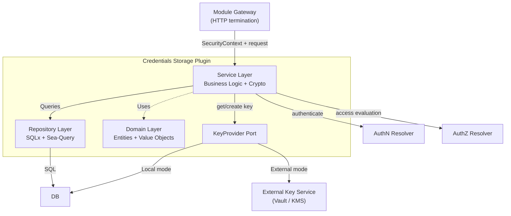
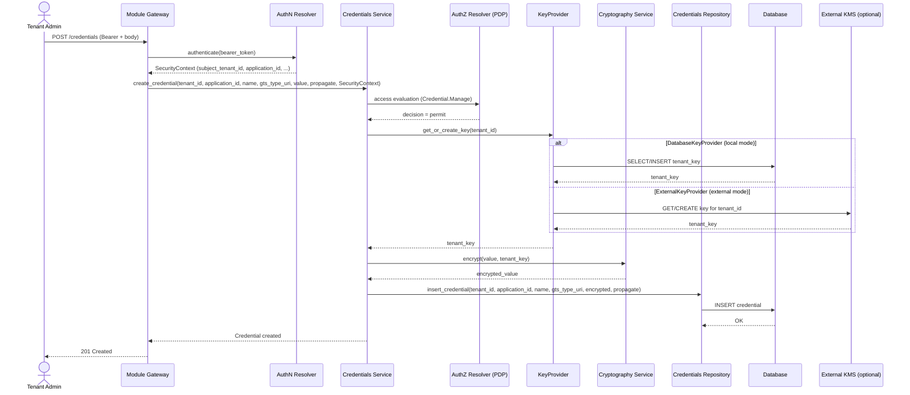
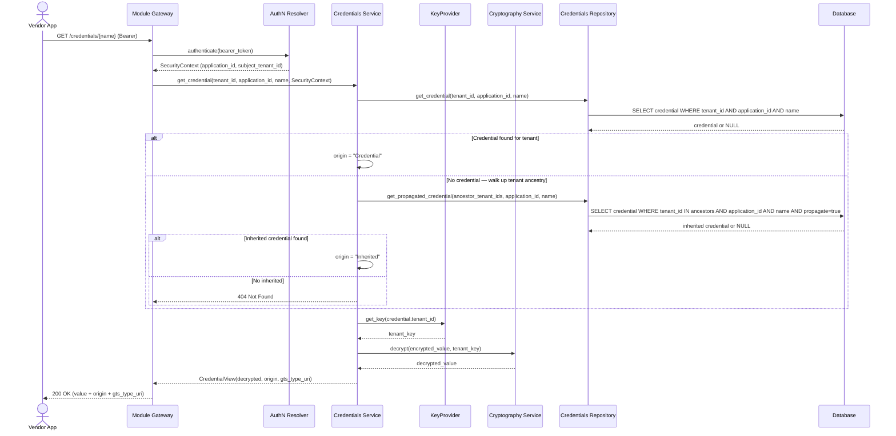

# Technical Design — Credentials Storage Plugin

- [ ] `p3` - **ID**: `cpt-pc-cs-design-credentials-storage`

<!-- toc -->

- [1. Architecture Overview](#1-architecture-overview)
  - [1.1 Architectural Vision](#11-architectural-vision)
  - [1.2 Architecture Drivers](#12-architecture-drivers)
  - [1.3 Architecture Layers](#13-architecture-layers)
- [2. Principles & Constraints](#2-principles--constraints)
  - [2.1 Design Principles](#21-design-principles)
  - [2.2 Constraints](#22-constraints)
- [3. Technical Architecture](#3-technical-architecture)
  - [3.1 Domain Model](#31-domain-model)
  - [3.2 Component Model](#32-component-model)
  - [3.3 External Dependencies](#33-external-dependencies)
  - [3.4 Interactions & Sequences](#34-interactions--sequences)
  - [3.5 Database schemas & tables](#35-database-schemas--tables)
- [4. Additional context](#4-additional-context)

<!-- /toc -->

## 1. Architecture Overview

### 1.1 Architectural Vision

Credentials Storage is designed as a self-contained module (deployable as part of the CredStore gateway or as a
standalone microservice) with a layered hexagonal architecture that isolates domain logic from infrastructure concerns.
The architecture prioritizes security-by-default: every credential value is encrypted before reaching the persistence
layer, and access is enforced at multiple levels — AuthN-validated identity (via the CyberFabric AuthN Resolver),
authorization decisions from the CyberFabric AuthZ Resolver for write operations, and `application_id`-scoped read
access so callers can only see credentials owned by their own application.

Stage 1 focuses strictly on encrypted storage and tenant-hierarchy propagation for credentials. Credential type
definitions (formerly modeled as `Schema` and `CredentialDefinition` entities) are delegated to the Global Type System
(GTS, `https://github.com/GlobalTypeSystem/gts-spec`), which is already the platform's type system for plugin
registration. Each credential carries an opaque GTS type URI; GTS-backed validation and default-value resolution are
deferred to stage 2.

Tenant encryption key management is abstracted behind a `KeyProvider` port, allowing keys to be stored either locally
(in-database, for development and simple deployments) or in a separate, hardened key management service (for production
environments where cryptographic isolation is required). This separation ensures that compromising the credentials
database does not expose encryption keys, and vice versa.

### 1.2 Architecture Drivers

Requirements that significantly influence architecture decisions.

#### Functional Drivers

| Requirement                                                         | Design Response                                                                                      |
|---------------------------------------------------------------------|------------------------------------------------------------------------------------------------------|
| `cpt-pc-cs-fr-credential-encrypt` — Encrypt all values at rest      | Dedicated cryptography service with AES-256-GCM; per-tenant key management via pluggable KeyProvider  |
| `cpt-pc-cs-fr-credential-propagate` — Hierarchical propagation      | Credential merge logic in service layer resolves own → inherited chain up the tenant tree            |
| `cpt-pc-cs-fr-credential-decrypt-app` — Decrypted values for apps   | Service layer decrypts credentials for the owning application using the tenant's encryption key       |
| `cpt-pc-cs-fr-auth-authn` — AuthN Resolver authentication           | Axum AuthN middleware calls the CyberFabric AuthN Resolver; `SecurityContext` propagated through request context |
| `cpt-pc-cs-fr-auth-permission` — Permission checks                  | PEP handler calls the CyberFabric AuthZ Resolver (PDP) before write operations and applies returned constraints  |

#### NFR Allocation

| NFR ID                           | NFR Summary                        | Allocated To                                 | Design Response                                                                                        | Verification Approach                                                                    |
|----------------------------------|------------------------------------|----------------------------------------------|--------------------------------------------------------------------------------------------------------|------------------------------------------------------------------------------------------|
| `cpt-pc-cs-nfr-encryption`       | 100% encryption at rest            | Cryptography Service + KeyProvider           | All credential values pass through encrypt() before persistence; no direct DB writes bypass encryption | Integration tests verify no plaintext in DB                                              |
| `cpt-pc-cs-nfr-tenant-isolation` | Per-tenant cryptographic isolation | KeyProvider + Cryptography Service           | Each tenant has a unique AES-256 key; keys never shared across tenants; keys can be isolated in external KMS | Unit tests verify key uniqueness; integration tests verify cross-tenant decryption fails |
| `cpt-pc-cs-nfr-response-time`    | p95 ≤ 100ms at 100 concurrent      | All layers                                   | Async I/O via Tokio; connection pooling; AuthN/AuthZ Resolver calls reused across requests             | Load testing with k6 or similar                                                          |

### 1.3 Architecture Layers

- [ ] `p3` - **ID**: `cpt-pc-cs-tech-layers`

| Layer          | Responsibility                                                                      | Technology                     |
|----------------|-------------------------------------------------------------------------------------|--------------------------------|
| Service        | Business logic, credential merge (own → inherited), encryption/decryption           | Core Rust, AES-GCM, Serde JSON |
| Repository     | Data access, query construction, connection management                              | SQLx 0.8, Sea-Query 0.32       |
| KeyProvider    | Tenant key retrieval and creation; abstracts local DB vs external key service       | Trait-based port (see §3.2)    |
| Domain         | Core entities (Credential, TenantKey), value objects, enums                         | Pure Rust structs              |
| Infrastructure | Configuration, telemetry, server lifecycle, connection pooling                      | Tokio, OpenTelemetry, Clap     |

## 2. Principles & Constraints

### 2.1 Design Principles

#### Encryption by Default

- [ ] `p2` - **ID**: `cpt-pc-cs-principle-encryption-default`

All credential values are encrypted before leaving the service layer. The repository layer never receives plaintext
credential data. This ensures that even in the event of a database compromise or SQL injection, credential values remain
protected.

#### Tenant Isolation

- [ ] `p2` - **ID**: `cpt-pc-cs-principle-tenant-isolation`

Each tenant's credentials are encrypted with a unique per-tenant key. No shared encryption keys exist between tenants.
This provides cryptographic isolation — compromising one tenant's key does not expose another tenant's data.

#### Key–Data Separation

- [ ] `p1` - **ID**: `cpt-pc-cs-principle-key-data-separation`

Encryption keys and encrypted data MUST be separable into distinct security domains. The service abstracts key
management behind a `KeyProvider` port so that tenant keys can reside in a separate, hardened service (e.g., HashiCorp
Vault, AWS KMS, or a dedicated internal key management service) rather than in the same database as encrypted
credentials. This ensures that a single breach (database compromise, SQL injection, backup leak) does not expose both
ciphertext and the keys needed to decrypt it.

#### Least Privilege Access

- [ ] `p2` - **ID**: `cpt-pc-cs-principle-least-privilege`

Access control is enforced at multiple levels: the CyberFabric AuthN Resolver verifies identity and produces a
`SecurityContext`; the CyberFabric AuthZ Resolver returns the access decision (and optional query-level constraints);
and credential lookup is scoped by the caller's `application_id` so callers can only see credentials owned by their
application.

#### Defense in Depth

- [ ] `p2` - **ID**: `cpt-pc-cs-principle-defense-in-depth`

Security is layered: network-level (transport and network policy as provided by the runtime), transport-level (TLS),
authentication (CyberFabric AuthN Resolver), authorization (CyberFabric AuthZ Resolver), application scoping (credential
lookup filtered by `SecurityContext.application_id`), and data-level (AES-256-GCM encryption). No single layer's failure
exposes credentials.

#### Clean Architecture

- [ ] `p3` - **ID**: `cpt-pc-cs-principle-clean-architecture`

Domain entities have zero dependencies on infrastructure. The service layer orchestrates business logic without
knowledge of HTTP or SQL specifics. This separation enables unit testing of business logic without database or network
setup.

### 2.2 Constraints
#### Database Persistence

- [ ] `p2` - **ID**: `cpt-pc-cs-constraint-db`

All persistent data (credentials and, when `DatabaseKeyProvider` is active, tenant keys) must be stored in the
platform-provided database. CyberFabric is database-agnostic; the concrete engine is selected by platform configuration.
No alternative storage backends (e.g., object stores, in-memory caches) are permitted for primary persistence without a
new ADR.

#### Horizontal Scalability & Operability

- [ ] `p2` - **ID**: `cpt-pc-cs-constraint-scalability`

The module must be runnable as stateless, horizontally scalable instances behind a load balancer — with no in-process
state that prevents scale-out. Instances must expose readiness and liveness signals, support graceful shutdown (drain
in-flight requests before exit), and tolerate rolling updates without dropped requests. The concrete runtime environment
(Kubernetes, bare VMs, managed container platforms) is not prescribed; CyberFabric is environment-agnostic.

#### Authenticated Caller Required

- [ ] `p2` - **ID**: `cpt-pc-cs-constraint-authn`

All plugin operations require an authenticated caller. The plugin MUST NOT terminate HTTP or validate bearer tokens;
token validation is performed at the Module Gateway, which delegates to the CyberFabric AuthN Resolver and produces a
`SecurityContext`. The plugin consumes that `SecurityContext` (`subject_id`, `subject_tenant_id`, `token_scopes`, and
`application_id` when present) supplied by the Module Gateway and propagates it through its internal service layer.
Token format (JWT, opaque, or other) is owned by the AuthN Resolver plugin and is not observable inside this plugin.

#### Multi-Tenant Hierarchy Support

- [ ] `p2` - **ID**: `cpt-pc-cs-constraint-multi-tenant`

The service must support a hierarchical tenant model for credential propagation. Credential
resolution must traverse the tenant tree from child to parent.

## 3. Technical Architecture

### 3.1 Domain Model

**Technology**: Rust structs with Serde serialization

**Core Entities**:

| Entity     | Description                                                                                                                                                                           |
|------------|---------------------------------------------------------------------------------------------------------------------------------------------------------------------------------------|
| Credential | An encrypted tenant-specific credential value owned by an application, identified by name within that application, with propagation metadata and an opaque GTS type URI.              |
| TenantKey  | A per-tenant AES-256-GCM encryption key used for credential encryption and decryption. Managed by the `KeyProvider` port — may reside in local DB or an external key management service. |

**Relationships**:

- TenantKey 1→N Credential: each tenant key encrypts all credentials for that tenant (key resolution via `KeyProvider`)

**Notes on scope**:

Schema and credential-definition concerns (type/shape declaration, default values, application access control lists)
are out of scope for stage 1. Credential type information is represented as an opaque GTS type URI stored alongside each
credential; resolving, validating, or propagating that type is delegated to the Global Type System (see
`https://github.com/GlobalTypeSystem/gts-spec`) and is not performed by this module. Stage 2 will introduce GTS-backed
validation and default-value resolution.

### 3.2 Component Model

#### Services

- [ ] `p2` - **ID**: `cpt-pc-cs-component-services`

##### Why this component exists

Encapsulates all business logic including credential CRUD orchestration, encryption/decryption, credential
merge/propagation resolution.

##### Responsibility scope

Orchestrate credential lifecycle: encrypt values, persist via repository. Resolve credential merge from two sources
(own → inherited) by walking the tenant hierarchy. Obtain tenant encryption keys via `KeyProvider` (auto-generate on
first use). Perform cryptographic operations (AES-256-GCM encrypt/decrypt).

##### Responsibility boundaries

Does NOT validate credential values against their GTS type — the type URI is stored opaquely and validation is
deferred to stage 2 (delegated to GTS). Does NOT handle HTTP concerns (routing, status codes). Does NOT construct SQL
queries — delegates to repositories. Does NOT manage database connections.

##### Related components (by ID)

- `cpt-pc-cs-component-repositories` — delegates data persistence
- `cpt-pc-cs-component-key-provider` — obtains tenant encryption keys for crypto operations
- `cpt-pc-cs-component-domain` — uses domain entities for business operations

#### KeyProvider

- [ ] `p1` - **ID**: `cpt-pc-cs-component-key-provider`

##### Why this component exists

Decouples tenant key management from the credential storage service, enabling encryption keys to be stored in a
separate security domain from the encrypted data. This is a critical cybersecurity boundary: if the credentials database
is compromised, the attacker gains only ciphertext without the keys to decrypt it.

##### Responsibility scope

Provide a `KeyProvider` trait (async port) with two operations: `get_or_create_key(tenant_id) → TenantKey` and
`get_key(tenant_id) → Option<TenantKey>`. Two implementations:

1. **`DatabaseKeyProvider`** (default) — stores keys in the local `tenant_keys` table. Suitable for development,
   testing, and single-tenant deployments where operational simplicity is prioritized over key isolation.

2. **`ExternalKeyProvider`** — delegates key storage and retrieval to an external key management service
   (e.g., HashiCorp Vault Transit secrets engine, AWS KMS, Azure Key Vault, or a dedicated internal KMS).
   Suitable for production multi-tenant deployments where regulatory or security requirements demand that
   encryption keys are never co-located with encrypted data.

The active implementation is selected by configuration (`key_provider` field). The `ExternalKeyProvider` communicates
with the external service over mTLS and authenticates via service-specific credentials (Vault token, IAM role, etc.).

##### Responsibility boundaries

Does NOT perform encryption/decryption — only manages key lifecycle (create, retrieve, future: rotate).
Does NOT contain business logic. Does NOT access credential data.

##### Related components (by ID)

- `cpt-pc-cs-component-services` — service layer calls KeyProvider to obtain keys for encrypt/decrypt operations
- `cpt-pc-cs-component-domain` — uses TenantKey domain entity

#### Repositories

- [ ] `p2` - **ID**: `cpt-pc-cs-component-repositories`

##### Why this component exists

Abstracts all database interactions, providing a clean data access interface to the service layer without exposing SQL
or database-specific concerns.

##### Responsibility scope

CRUD operations for credentials. Construct type-safe SQL queries via Sea-Query. Map database rows to domain entities.
Manage transactions where required.

##### Responsibility boundaries

Does NOT contain business logic. Does NOT perform encryption — receives already-encrypted data. Does NOT resolve or
validate GTS types — the `gts_type_uri` column is stored and returned opaquely. Does NOT manage tenant keys (delegated
to `KeyProvider`).

##### Related components (by ID)

- `cpt-pc-cs-component-services` — called by service layer for data access
- `cpt-pc-cs-component-domain` — maps DB rows to domain entities

#### Domain

- [ ] `p2` - **ID**: `cpt-pc-cs-component-domain`

##### Why this component exists

Defines core business entities and value objects with zero infrastructure dependencies, ensuring domain logic is
testable and portable.

##### Responsibility scope

Define Credential and TenantKey entities. Define CredentialOrigin enum (Credential, Inherited). Define CredentialView
for merged credential representations.

##### Responsibility boundaries

Does NOT depend on any infrastructure crate (no SQLx, no Axum, no HTTP). Does NOT contain persistence logic. Pure data
structures with business semantics.

##### Related components (by ID)

- `cpt-pc-cs-component-services` — services operate on domain entities
- `cpt-pc-cs-component-repositories` — repositories map to/from domain entities

#### Infrastructure

- [ ] `p3` - **ID**: `cpt-pc-cs-component-infrastructure`

##### Why this component exists

Manages cross-cutting concerns: application configuration, server lifecycle, telemetry, connection pooling, and
dependency wiring.

##### Responsibility scope

Load configuration from environment variables. Initialize database connection pool. Set up OpenTelemetry tracing and
metrics. Configure Axum router with all routes and middleware. Manage graceful server shutdown. Provide ApiState for
dependency injection across layers.

##### Responsibility boundaries

Does NOT contain business logic. Does NOT handle individual HTTP requests. Bootstraps the application and provides
shared infrastructure.

##### Related components (by ID)

- `cpt-pc-cs-component-services` — infrastructure creates service instances in ApiState

### 3.3 External Dependencies

#### Database

| Aspect                | Details                                                                          |
|-----------------------|----------------------------------------------------------------------------------|
| Purpose               | Persistent storage for credentials. Tenant keys stored here only when `DatabaseKeyProvider` is active.                           |
| Protocol              | TCP/SQL via SQLx async driver                                                    |
| Authentication        | Username/password from environment configuration                                 |
| Connection Management | Connection pool via `db-utils`; configurable pool size                           |

#### External Key Management Service (optional)

| Aspect         | Details                                                                       |
|----------------|-------------------------------------------------------------------------------|
| Purpose        | Tenant encryption key storage and lifecycle when `ExternalKeyProvider` is active. Provides key–data separation for production security posture. |
| Protocol       | HTTPS/mTLS (Vault HTTP API, AWS KMS API, or custom REST/gRPC)                |
| Authentication | Service-specific: Vault token, cloud IAM role, runtime service identity        |
| Error Handling | Key Service unavailable blocks all encrypt/decrypt operations; readiness signal reflects KMS connectivity |

#### CyberFabric AuthZ Resolver

| Aspect         | Details                                                                                      |
|----------------|----------------------------------------------------------------------------------------------|
| Purpose        | Authorization (PDP) — returns the decision and optional query-level constraints for `Credential.Manage` on write operations |
| Protocol       | In-process plugin call or out-of-process gRPC (AuthZEN-style request/response)               |
| Authentication | Same-process trust in-process; mTLS for out-of-process deployments                           |
| Error Handling | Deny decision is returned to the caller as a permission error; resolver unavailable blocks write operations |

> **Note on authentication**: Bearer-token validation is not a dependency of this plugin. Token validation is owned by the Module Gateway, which calls the CyberFabric AuthN Resolver and supplies the resulting `SecurityContext` to the plugin. The `SecurityContext` shape contract is captured in PRD §7.2 (`cpt-pc-cs-contract-authn`).

### 3.4 Interactions & Sequences

#### Create Credential with Encryption

**ID**: `cpt-pc-cs-seq-create-credential`

**Use cases**: `cpt-pc-cs-usecase-admin-manage-creds`

**Actors**: `cpt-pc-cs-actor-tenant-admin`

**Description**: Administrator creates a credential. The Module Gateway terminates HTTP and delegates token validation
to the AuthN Resolver, which produces a `SecurityContext`; the Gateway then invokes the plugin with that context. The
plugin's Credentials Service obtains the access decision for `Credential.Manage` from the AuthZ Resolver (PDP), then
retrieves the tenant's encryption key via the `KeyProvider` port (either from local DB or an external key management
service), encrypts the value, and persists it together with its opaque `gts_type_uri`. Type validation against the GTS
type is deferred to stage 2.

#### Retrieve Credential with Merge Resolution

**ID**: `cpt-pc-cs-seq-retrieve-credential`

**Use cases**: `cpt-pc-cs-usecase-app-retrieve-cred`, `cpt-pc-cs-usecase-credential-inheritance`

**Actors**: `cpt-pc-cs-actor-vendor-app`

**Description**: Application retrieves a credential. The Module Gateway terminates HTTP and supplies the plugin with a
`SecurityContext` produced by the AuthN Resolver. Inside the plugin, credential lookup is scoped by `application_id`
from the `SecurityContext`, so callers only see credentials owned by their application. The service resolves the value
through the two-source merge chain (own → inherited by walking the tenant ancestry for credentials with
`propagate=true`), decrypts with the owning tenant's key, and returns the value together with its origin and opaque
`gts_type_uri`. If no value is found at either level the response is 404 — default-value fallback is deferred to stage
2 (delegated to GTS).

### 3.5 Database schemas & tables

- [ ] `p3` - **ID**: `cpt-pc-cs-db-main`

#### Table: credentials

**ID**: `cpt-pc-cs-dbtable-credentials`

| Column          | Type         | Description                                                                                              |
|-----------------|--------------|----------------------------------------------------------------------------------------------------------|
| id              | UUID         | Primary key                                                                                              |
| tenant_id       | UUID         | Tenant that owns this credential                                                                         |
| application_id  | UUID         | Owning application ID (from `SecurityContext.application_id` at creation time)                           |
| name            | VARCHAR(255) | Credential name (unique per tenant + application, case-insensitive)                                      |
| gts_type_uri    | TEXT         | Opaque GTS type URI describing the credential value's type (not interpreted or validated by this module) |
| encrypted_value | BYTEA        | AES-256-GCM encrypted credential value (nonce prepended)                                                 |
| propagate       | BOOLEAN      | Whether this credential propagates to child tenants                                                      |
| key_id          | UUID         | Foreign key to tenant_keys table (encryption key used)                                                   |
| created         | TIMESTAMPTZ  | Creation timestamp                                                                                       |

**PK**: `id`
**Constraints**: UNIQUE(tenant_id, application_id, name), FK(key_id → tenant_keys.id), NOT NULL(tenant_id,
application_id, name, gts_type_uri, encrypted_value, key_id)

#### Table: tenant_keys

**ID**: `cpt-pc-cs-dbtable-tenant-keys`

| Column    | Type        | Description                                              |
|-----------|-------------|----------------------------------------------------------|
| id        | UUID        | Primary key                                              |
| tenant_id | UUID        | Tenant this key belongs to (unique — one key per tenant) |
| key       | VARCHAR(64) | Base64-encoded 32-byte AES-256 encryption key            |
| created   | TIMESTAMPTZ | Key creation timestamp                                   |

**PK**: `id`
**Constraints**: UNIQUE(tenant_id), NOT NULL(tenant_id, key)

**Additional info**: This table is used only by the `DatabaseKeyProvider` implementation. When the `ExternalKeyProvider`
is active, this table is not used — keys are stored and managed by the external key management service. Tenant keys are
auto-generated when the first credential is created for a tenant.

**Security note**: In production multi-tenant deployments, the `ExternalKeyProvider` is strongly recommended. Storing
encryption keys in the same database as encrypted credentials means a single database compromise exposes both ciphertext
and keys. See `cpt-pc-cs-principle-key-data-separation`.

## 4. Additional context

- Stage 1 scope excludes schema and credential-definition management. Credential type information is stored as an
  opaque GTS type URI (`gts_type_uri` column); this module does not resolve, validate, or interpret it. Stage 2 will
  introduce GTS-backed validation and default-value resolution by reusing the Global Type System
  (`https://github.com/GlobalTypeSystem/gts-spec`), which is already the platform's type system for plugin registration
  (see `modules/credstore/docs/DESIGN.md`).
- Application-level access control lists (`allowed_app_ids`) are out of scope for stage 1. Read access is scoped by
  the caller's `SecurityContext.application_id` — a credential is only visible to its owning application. Cross-app
  sharing will be revisited in a later stage once GTS-backed credential definitions are introduced.
- User secrets (personal secrets per user, similar to Google Colab secrets) are a planned capability not yet
  implemented. The current data model may need extensions to support user-scoped credentials.
- Encryption key storage in the application database (`DatabaseKeyProvider`) is suitable for development and
  single-tenant deployments. For production multi-tenant environments, the `ExternalKeyProvider` delegates key
  management to a separate service (HashiCorp Vault, AWS KMS, etc.) to achieve key–data separation.
  See `cpt-pc-cs-principle-key-data-separation` and `cpt-pc-cs-component-key-provider`.
- Key rotation is not yet implemented. The `KeyProvider` abstraction is designed to accommodate future key rotation
  support — the external KMS can manage key versions while the service re-encrypts credentials on rotation events.